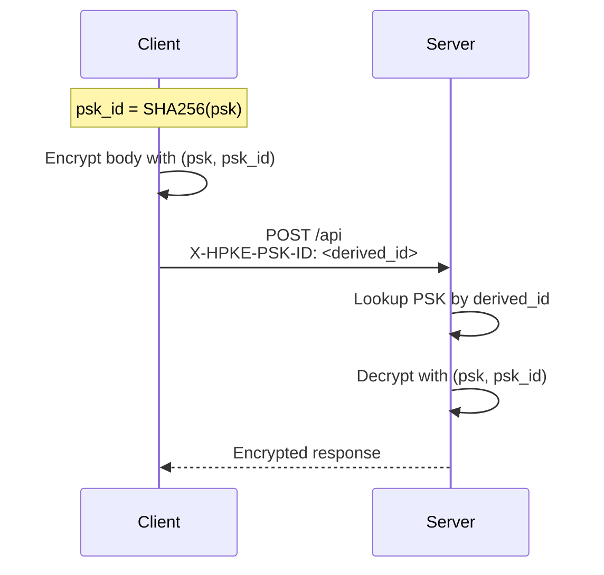

# hpke-http

End-to-end encryption for HTTP APIs using RFC 9180 HPKE (Hybrid Public Key Encryption). Drop-in middleware for FastAPI, aiohttp, and httpx.

[](https://github.com/dualeai/hpke-http/actions/workflows/test.yml)
[](https://codspeed.io/dualeai/hpke-http?utm_source=badge)
[](https://pypi.org/project/hpke-http/)
[](https://pypi.org/project/hpke-http/)
[](https://pypi.org/project/hpke-http/)
[](https://opensource.org/licenses/Apache-2.0)

## Highlights

- **Transparent** - Drop-in middleware, no application code changes
- **End-to-end encryption** - Protects data even when TLS terminates at CDN or load balancer
- **PSK binding** - Each request cryptographically bound to pre-shared key (API key)
- **Replay protection** - Counter-based nonces prevent replay attacks
- **RFC 9180 compliant** - Auditable, interoperable standard
- **Post-quantum** - X-Wing hybrid KEM (X25519 + ML-KEM-768) for harvest-now-decrypt-later defense; clients auto-upgrade when server registers an X-Wing key (see [Post-Quantum (X-Wing)](#post-quantum-x-wing))
- **Memory-efficient** - Streams large file uploads with O(chunk_size) memory

## Installation

```bash
uv add "hpke-http[fastapi]"       # Server
uv add "hpke-http[aiohttp]"       # Client (aiohttp)
uv add "hpke-http[httpx]"         # Client (httpx)
uv add "hpke-http[fastapi,zstd]"  # + zstd compression (gzip fallback included)
```

## Quick Start

Standard JSON requests, SSE (Server-Sent Events) streaming, and file uploads are transparently encrypted.

### Server (FastAPI)

```python
from fastapi import FastAPI, Request
from fastapi.responses import StreamingResponse
from starlette.exceptions import HTTPException
from hpke_http.middleware.fastapi import HPKEMiddleware
from hpke_http.constants import KemId

app = FastAPI()

async def resolve_psk(scope: dict) -> tuple[bytes, bytes]:
    api_key_fingerprint = scope.get("hpke_psk_id")
    record = await db.lookup_by_fingerprint(api_key_fingerprint)
    if record is None:
        raise HTTPException(401, "Unknown API key")  # Forwarded to client
    scope["tenant_id"] = record["tenant_id"]
    return (record["psk"], api_key_fingerprint)

app.add_middleware(
    HPKEMiddleware,
    private_keys={KemId.DHKEM_X25519_HKDF_SHA256: private_key},
    psk_resolver=resolve_psk,
)

@app.post("/users")
async def create_user(request: Request):
    data = await request.json()  # Decrypted by middleware
    return {"id": 123, "name": data["name"]}  # Encrypted by middleware

@app.get("/users/{user_id}")
async def get_user(request: Request):
    return {"id": 123, "name": "Alice"}  # Encrypted by middleware

@app.post("/chat")
async def chat(request: Request):
    data = await request.json()

    async def generate():
        yield b"event: progress\ndata: {\"step\": 1}\n\n"
        yield b"event: complete\ndata: {\"result\": \"done\"}\n\n"

    return StreamingResponse(generate(), media_type="text/event-stream")
```

### Client (aiohttp)

```python
import hashlib
import aiohttp
from hpke_http.middleware.aiohttp import HPKEClientSession

# PSK ID identifies *which* API key is in use; derive it from the key
# itself so observers cannot link traffic by tenant (see "PSK Authentication").
api_key_fingerprint = hashlib.sha256(api_key).digest()

async with HPKEClientSession(
    base_url="https://api.example.com",
    psk=api_key,                    # >= 32 bytes
    psk_id=api_key_fingerprint,     # opaque key identifier
    # compress=True,                # Compression (zstd preferred, gzip fallback)
    # require_encryption=True,      # Raise if server responds unencrypted
    # release_encrypted=True,       # Free encrypted bytes after decryption (saves memory)
) as session:
    # POST with JSON body
    async with session.post("/users", json={"name": "Alice"}) as resp:
        user = await resp.json()

    # SSE streaming
    async with session.post("/chat", json={"prompt": "Hello"}) as resp:
        async for chunk in session.iter_sse(resp):
            print(chunk)  # b"event: progress\ndata: {...}\n\n"

    # GET (bodyless) - response is still encrypted
    async with session.get("/users/123") as resp:
        user = await resp.json()

    # File upload - streams with O(chunk_size) memory
    form = aiohttp.FormData()
    form.add_field("file", open("large.pdf", "rb"), filename="large.pdf")
    async with session.post("/upload", data=form) as resp:
        result = await resp.json()
```

### Client (httpx)

```python
import hashlib
from hpke_http.middleware.httpx import HPKEAsyncClient

# PSK ID identifies *which* API key is in use; derive it from the key
# itself so observers cannot link traffic by tenant (see "PSK Authentication").
api_key_fingerprint = hashlib.sha256(api_key).digest()

async with HPKEAsyncClient(
    base_url="https://api.example.com",
    psk=api_key,                    # >= 32 bytes
    psk_id=api_key_fingerprint,     # opaque key identifier
    # compress=True,                # Compression (zstd preferred, gzip fallback)
    # require_encryption=True,      # Raise if server responds unencrypted
    # release_encrypted=True,       # Free encrypted bytes after decryption (saves memory)
) as client:
    # POST with JSON body
    resp = await client.post("/users", json={"name": "Alice"})
    user = resp.json()

    # SSE streaming
    resp = await client.post("/chat", json={"prompt": "Hello"})
    async for chunk in client.iter_sse(resp):
        print(chunk)  # b"event: progress\ndata: {...}\n\n"

    # GET (bodyless) - response is still encrypted
    resp = await client.get("/users/123")
    user = resp.json()

    # File upload - streams with O(chunk_size) memory
    resp = await client.post("/upload", files={"file": open("large.pdf", "rb")})
    result = resp.json()
```

## Documentation

- [RFC 9180 - HPKE](https://datatracker.ietf.org/doc/rfc9180/)
- [RFC 7748 - X25519](https://datatracker.ietf.org/doc/rfc7748/)
- [RFC 5869 - HKDF](https://datatracker.ietf.org/doc/rfc5869/)
- [RFC 8439 - ChaCha20-Poly1305](https://datatracker.ietf.org/doc/rfc8439/)
- [RFC 8878 - Zstandard](https://datatracker.ietf.org/doc/rfc8878/) (preferred compression)
- [RFC 1952 - Gzip](https://datatracker.ietf.org/doc/rfc1952/) (fallback compression, always available)
- [RFC 9110 - HTTP Semantics](https://datatracker.ietf.org/doc/rfc9110/) (Accept-Encoding negotiation)

## Cipher Suite

| Component | Algorithm | ID |
| --------- | --------- | ------ |
| KEM (Key Encapsulation, classical) | DHKEM(X25519, HKDF-SHA256) | 0x0020 |
| KEM (Key Encapsulation, post-quantum) | X-Wing (X25519 + ML-KEM-768) | 0x647A |
| KDF (Key Derivation) | HKDF-SHA256 | 0x0001 |
| AEAD (Authenticated Encryption) | ChaCha20-Poly1305 | 0x0003 |
| Mode | PSK (Pre-Shared Key) | 0x01 |

Clients pick the best advertised KEM per ``DEFAULT_KEM_PRIORITY`` —
post-quantum first, classical fallback. See [Post-Quantum (X-Wing)](#post-quantum-x-wing).

## Post-Quantum (X-Wing)

X-Wing is a hybrid post-quantum KEM combining X25519 with ML-KEM-768 (FIPS 203).
Server-side opt-in: register an X-Wing private key in ``HPKEMiddleware`` and
clients automatically upgrade. X25519-only deployments work unchanged
(server doesn't register an X-Wing key → not advertised → clients fall back
to X25519).

### Why

X25519 falls to Shor's algorithm on a cryptographically-relevant quantum
computer. Any traffic captured today and decrypted later — the
"harvest-now-decrypt-later" threat — is exposed retroactively. X-Wing's
ML-KEM-768 leg defends against this; the X25519 leg keeps a classical
fallback in case ML-KEM is later cryptanalyzed.

### Status

Pre-RFC. The IANA HPKE registry has assigned `0x647A` as an early allocation
referencing `draft-connolly-cfrg-xwing-kem-06`; we implement the wire format
of the latest revision (`draft-connolly-cfrg-xwing-kem-10`), pinned at
`hpke_http.constants.XWING_DRAFT_REVISION`. The wire format may change
before RFC publication — version-tag any X-Wing traffic accordingly.

### Server: register an X-Wing key

X-Wing private keys are 32-byte seeds (the wire-canonical form). Generate one
with `XWingKEM.generate_keypair()` and register both the X25519 and X-Wing
keys on the middleware:

```python
from hpke_http.constants import KemId
from hpke_http.middleware.fastapi import HPKEMiddleware
from hpke_http.primitives import X25519KEM, XWingKEM

x25519_sk, _ = X25519KEM.generate_keypair()
xwing_sk, _ = XWingKEM.generate_keypair()  # 32-byte seed

app.add_middleware(
    HPKEMiddleware,
    private_keys={
        KemId.DHKEM_X25519_HKDF_SHA256: x25519_sk,
        KemId.XWING: xwing_sk,
    },
    psk_resolver=resolve_psk,
)
```

The middleware advertises both KEMs on `/.well-known/hpke-keys`; clients pick
which to use.

### Client: zero config

Clients automatically pick the best suite the server advertises, per the
default priority order in
`hpke_http.constants.DEFAULT_KEM_PRIORITY = (KemId.XWING, KemId.DHKEM_X25519_HKDF_SHA256)`.
Server with X-Wing key registered → client uses X-Wing. Server with only
X25519 → client uses X25519. No client-side flag.

```python
import hashlib
from hpke_http.middleware.httpx import HPKEAsyncClient

api_key_fingerprint = hashlib.sha256(api_key).digest()

client = HPKEAsyncClient(
    base_url="https://api.example.com",
    psk=api_key,
    psk_id=api_key_fingerprint,
)
```

To pin a specific suite (e.g. force classical for testing or compliance):

```python
from hpke_http.constants import KemId

client = HPKEAsyncClient(
    base_url="https://api.example.com",
    psk=api_key,
    psk_id=api_key_fingerprint,
    kem_priority=[KemId.DHKEM_X25519_HKDF_SHA256],  # never use X-Wing
)
```

`kem_priority` is a left-to-right preference list and is **strict**: if
no entry matches a server-advertised KEM, the client raises
`KeyDiscoveryError` rather than silently picking an unlisted KEM. Pin
intent is preserved (e.g. classical-only client never silently upgrades
to X-Wing). Same kwarg works on `HPKEClientSession` (aiohttp).

### Wire effect

X25519 traffic is byte-equivalent to pre-X-Wing: no extra header, X25519
enc (43 base64url chars). X-Wing traffic adds:

```
X-HPKE-Suite: kem=0x647a
X-HPKE-Enc:   <base64url(1120 bytes) = 1494 chars>
```

`X-HPKE-Suite` value format is strict: `kem=0x{kem_id:04x}`, lowercase, no
whitespace, no extra params. Header is omitted entirely for the legacy
X25519 default to keep wire identical for existing deployments.

### Server error responses (PQ-related)

| Status | Trigger |
|--------|---------|
| `400 Bad Request` | Malformed `X-HPKE-Suite` (regex mismatch, oversize, extras), oversize `X-HPKE-Enc`, or `enc` length doesn't match the suite's `Nenc`. |
| `415 Unsupported Media Type` | Header advertises a `kem_id` the server hasn't registered (e.g., client sends `kem=0x647a` against an X25519-only deployment). |

All HPKE error responses set `X-HPKE-Error: true` so clients with
`require_encryption=True` can distinguish middleware errors from app
plaintext fall-throughs.

### Discovery doc

`/.well-known/hpke-keys` advertises every registered KEM:

```json
{
  "version": 1,
  "keys": [
    {"kem_id": "0x0020", "kdf_id": "0x0001", "aead_id": "0x0003", "public_key": "..."},
    {"kem_id": "0x647a", "kdf_id": "0x0001", "aead_id": "0x0003", "public_key": "..."}
  ],
  "default_suite": {"kem_id": "0x647a", ...}
}
```

`default_suite` is informational — clients run their own `_select_suite`
over the full `keys` array using their own `kem_priority`. Server-side
the field reflects ``DEFAULT_KEM_PRIORITY`` over registered keys
(post-quantum first, classical fallback): if X-Wing is registered, it's
the advertised default; otherwise X25519.

Clients silently skip unknown `kem_id` values from the discovery doc
(forward-compat: server may advertise future KEMs this client doesn't know).

### Performance

Indicative warm-cache latencies on Apple M-series, `cryptography` 48.0:

| Operation | X25519 | X-Wing (warm) | X-Wing (cold first call) |
|-----------|--------|---------------|--------------------------|
| `encap`   | ~360 µs | ~410 µs | ~420 µs |
| `decap`   | ~270 µs | ~380 µs | ~960 µs |
| `derive_public_key` | ~95 µs | ~30 µs (cached) / ~620 µs (cold) | — |

X-Wing is dominated by ML-KEM-768 (FIPS 203) keygen + encaps/decaps. Two
internal caches in `xwing_kem.py` keep the warm path tight:

- `_expand_decapsulation_key` (`maxsize=8`): caches per-seed `(MLKEM768
  private key, X25519 private key, pk_X)` triple. Server reuses one seed
  across all requests → ~100% hit rate. Avoids ~600 µs of FIPS 203 KeyGen
  per decap.
- `_load_mlkem_public` (`maxsize=16`): caches `MLKEM768PublicKey` handle per
  pk_M bytes. Client reuses one server pk repeatedly → ~100% hit rate.

Decap cold first-call is ~2.5× warm (~960 µs vs ~380 µs); encap cold barely
differs (encap doesn't run ML-KEM KeyGen). In production the first request
after process restart pays the cold decap cost; subsequent requests are
warm. Both caches are bounded; adversarial inputs cannot grow them past
`maxsize`.

AEAD seal/open per chunk and SSE chunk throughput are unchanged — KEM cost
is paid once per HPKE context, not per message. Long-lived encrypted streams
amortize KEM setup across many seal/opens.

### Adding a new KEM

`hpke-http` ships KEMs as plug-in modules behind the `KEM` ABC in
`src/hpke_http/primitives/kem_base.py`. To add a new KEM:

1. Add the IANA-assigned identifier to `KemId` in
   `src/hpke_http/constants.py`.
2. Create `src/hpke_http/primitives/<name>_kem.py` with a class subclassing
   `KEM` and decorated with `@register_kem`.
3. Import the module from `src/hpke_http/primitives/__init__.py` so the
   self-registration runs at package import time.

No changes to `hpke.py`, `core.py`, or middleware are needed; `get_kem()`
dispatches by `KemId`. See `primitives/x25519_kem.py` and
`primitives/xwing_kem.py` for reference implementations.

## PSK Authentication

HPKE PSK mode binds each request to a pre-shared key. This requires two values:

| Value | What it is | Example |
|-------|------------|---------|
| **PSK** | The secret key material | API key bytes, `b"sk_live_7f3a9c..."` |
| **PSK ID** | Identifies *which* PSK to use | `SHA256(api_key)` — 32 bytes recommended, min 1 byte |

> **Data model:** One tenant typically has *many* API keys (dev/prod, per-service, per-team-member). The PSK ID identifies the specific key, not the tenant.

### Security Considerations

[RFC 9180 §9.4](https://www.rfc-editor.org/rfc/rfc9180.html#section-9.4) warns that `psk_id` **"might be considered sensitive, since, in a given application context, [it] might identify the sender."**

The `X-HPKE-PSK-ID` header is sent in plaintext (only base64url-encoded, not encrypted). [RFC 9257](https://www.rfc-editor.org/rfc/rfc9257.html) documents the risks:

| Risk | Description |
|------|-------------|
| **Passive linkability** | Observers correlate connections using the same PSK ID |
| **Traffic analysis** | Identify specific API keys/users by their identifier |
| **Active suppression** | Targeted blocking based on observed identifiers |

### Mitigation: Derive PSK ID from the Key

**Derive `psk_id` from the PSK itself** ([RFC 9180 §9.4](https://www.rfc-editor.org/rfc/rfc9180.html#section-9.4)):



### Implementation

**Client** — derive PSK ID from key:

```python
import hashlib

api_key = b"sk_live_7f3a9c..."  # Your API key (>= 32 bytes)
api_key_fingerprint = hashlib.sha256(api_key).digest()

async with HPKEClientSession(
    base_url="https://api.example.com",
    psk=api_key,
    psk_id=api_key_fingerprint,
) as client:
    await client.post("/api", json=data)
```

**Server** — store derived ID when key created, lookup on request:

```python
import hashlib
from starlette.exceptions import HTTPException

# Key creation: store fingerprint → {psk, tenant_id}
api_key_fingerprint = hashlib.sha256(api_key).digest()
db.store(api_key_fingerprint, {"psk": api_key, "tenant_id": tenant_id})

# psk_resolver: lookup by fingerprint from header
async def resolve_psk(scope: dict) -> tuple[bytes, bytes]:
    api_key_fingerprint = scope.get("hpke_psk_id")
    record = await db.lookup(api_key_fingerprint)
    if record is None:
        raise HTTPException(401, "Unknown API key")
    scope["tenant_id"] = record["tenant_id"]
    return (record["psk"], api_key_fingerprint)
```

### Error Handling

The `psk_resolver` controls error responses by raising exceptions:

| Exception | Status | Behavior |
|-----------|--------|----------|
| `HTTPException(status, detail)` | User-defined | Forwarded to client with status code, detail, and headers |
| Any other exception | 401 | Generic "PSK authentication failed" |

```python
from starlette.exceptions import HTTPException

async def resolve_psk(scope: dict) -> tuple[bytes, bytes]:
    api_key_fingerprint = scope.get("hpke_psk_id")

    # Token revoked — tell the client exactly what happened
    record = await db.lookup(api_key_fingerprint)
    if record is None:
        raise HTTPException(401, "Unknown API key")
    if record["revoked"]:
        raise HTTPException(401, "API key revoked")

    # Authorization check — different status code
    if not record["scopes"].issuperset(required_scopes):
        raise HTTPException(403, "Insufficient permissions")

    # Backend unavailable — signal transient failure
    if not await auth_service.healthy():
        raise HTTPException(503, "Auth service unavailable")

    return (record["psk"], api_key_fingerprint)
```

Standard HTTP headers are forwarded too:

```python
raise HTTPException(
    401,
    "Bearer token required",
    headers={"WWW-Authenticate": "Bearer"},
)
```

This works identically for both encrypted and unencrypted requests.

## Wire Format

### Request/Response (Chunked Binary)

See [Header Modifications](#header-modifications) for when headers are added.

```text
Headers:
  X-HPKE-Suite: kem=0x{kem_id:04x}            (omitted when default X25519)
  X-HPKE-Enc:   <base64url(Nenc bytes)>       (32B for X25519; 1120B for X-Wing)
  X-HPKE-Stream: <base64url(4B session salt)>
  X-HPKE-PSK-ID: <base64url(derived key ID, 32B recommended)>

Body (repeating chunks):
┌───────────┬────────────┬─────────────────────────────────┐
│ Length(4B)│ Counter(4B)│ Ciphertext (N + 16B tag)        │
│ big-endian│ big-endian │ encrypted: encoding_id || data  │
└───────────┴────────────┴─────────────────────────────────┘
Overhead: 24B/chunk (4B length + 4B counter + 16B tag)
```

### SSE Event

```text
event: enc
data: <base64(counter_be32 || ciphertext)>
Decrypted: raw SSE chunk (e.g., "event: progress\ndata: {...}\n\n")
```

Uses standard base64 (not base64url) - SSE data fields allow +/= characters.

## Compression (Optional)

Zstd reduces bandwidth by **40-95%** for JSON/text. Enable with `compress=True` on both client and server. Payloads < 64 bytes skip compression. See [Compression table](#compression) for algorithm priority.

## Pitfalls

```python
# PSK too short
HPKEClientSession(psk=b"short", psk_id=...)     # InvalidPSKError
HPKEClientSession(psk=secrets.token_bytes(32), psk_id=...)  # >= 32 bytes

# PSK ID must be derived from the key (see "PSK Authentication" section)
api_key_fingerprint = hashlib.sha256(api_key).digest()
HPKEClientSession(psk=api_key, psk_id=api_key_fingerprint)   # Correct

# SSE missing content-type (won't use SSE format)
return StreamingResponse(gen())                                  # Binary format (wrong for SSE)
return StreamingResponse(gen(), media_type="text/event-stream")  # SSE format (correct)

# Standard responses work automatically - no special handling needed
return {"data": "value"}  # Auto-encrypted as binary chunks
```

## Limits

| Resource | Limit | Applies to |
| -------- | ----- | ---------- |
| HPKE messages/context | 2^96-1 | All |
| Chunks/session | 2^32-1 | All |
| PSK minimum | 32 bytes | All |
| PSK ID minimum | 1 byte | All |
| Chunk size | 64KB | All |
| Binary chunk overhead | 24B (length + counter + tag) | Requests & standard responses |
| SSE event buffer | 64MB (configurable) | SSE only |

> **Note:** SSE is text-only (UTF-8). Binary data must be base64-encoded (+33% overhead).

## HTTP Compatibility

### Protocol Support

| Feature | Supported | Notes |
| ------- | --------- | ----- |
| HTTP/1.1 | Yes | Chunked transfer encoding for streaming |
| HTTP/2 | Yes | Native framing (chunked encoding forbidden by spec) |
| HTTP/3 | Yes | QUIC streams, same semantics as HTTP/2 |
| WebSockets | No | Different protocol, not applicable |

### HTTP Methods

HPKE key exchange happens on every request, including bodyless methods like GET and DELETE.

| Method | Typical Use | Request Body | Response |
| ------ | ----------- | ------------ | -------- |
| POST | Create | Encrypted | Encrypted |
| PUT | Replace | Encrypted | Encrypted |
| PATCH | Update | Encrypted | Encrypted |
| DELETE | Remove | Encrypted (if body) | Encrypted |
| GET | Read | No body | Encrypted |
| HEAD | Metadata | No body | Headers only (no body per HTTP spec) |
| OPTIONS | Preflight | No body | Encrypted |

### Response Encryption (Server)

| Content-Type | Wire Format | Memory |
| ------------ | ----------- | ------ |
| Any non-SSE | Length-prefixed 64KB chunks | O(64KB) buffer |
| `text/event-stream` | Base64 SSE events | O(event size) |

### Response Decryption (Client)

| Content-Type | API | Memory | Delivery |
| ------------ | --- | ------ | -------- |
| Any non-SSE | `resp.json()`, `resp.content` | O(response size) | After full download |
| `text/event-stream` | `async for chunk in iter_sse(resp)` | O(event size) | As events arrive |

> Use `release_encrypted=True` to free encrypted buffer after decryption (reduces peak memory).

### Compression

| Algorithm | Request | Response | Priority |
| --------- | ------- | -------- | -------- |
| Zstd (RFC 8878) | Yes | Yes | 1 (preferred) |
| Gzip (RFC 1952) | Yes | Yes | 2 (fallback) |
| Identity | Yes | Yes | 3 (no compression) |

Auto-negotiated via `Accept-Encoding` header on discovery endpoint (`/.well-known/hpke-keys`).

#### Why HTTP-Level Compression Doesn't Help

Disable gzip/brotli on CDN/LB for HPKE endpoints. Ciphertext is incompressible—HTTP compression wastes CPU. Use `compress=True` on the client instead (compresses before encryption).

## Encryption Scope

### What IS Encrypted

| Component | Encrypted | Format |
| --------- | --------- | ------ |
| Request body | Yes | Binary chunks |
| Response body | Yes | Binary chunks or SSE events |

### What is NOT Encrypted

| Component | Visible to | Reason |
| --------- | ---------- | ------ |
| URL path | Network | Routing requires plaintext |
| Query parameters | Network | Part of URL |
| HTTP method | Network | Protocol requirement |
| HTTP headers | Network | Routing, caching, auth |
| Status code | Network | Protocol requirement |
| TLS metadata | Network | Transport layer |

### Header Modifications

| Header | Request | Response | Reason |
| ------ | ------- | -------- | ------ |
| `Content-Type` | Set to `application/octet-stream` (if body) | Preserved | Encrypted body is binary |
| `Content-Length` | Auto (chunked, if body) | Removed | Size changes after encryption |
| `X-HPKE-Suite` | Added (non-default KEM only) | - | Suite negotiation: `kem=0x{id:04x}` |
| `X-HPKE-Enc` | Always | - | Encapsulated key (size varies per suite) |
| `X-HPKE-Stream` | Always | Added | Session salt for nonces |
| `X-HPKE-PSK-ID` | Always | - | Derived PSK identifier (see [PSK Authentication](#psk-authentication)) |
| `X-HPKE-Encoding` | Added (if compressed) | - | Compression algorithm |
| `X-HPKE-Content-Type` | Added (if body) | - | Original Content-Type for server parsing |
| `X-HPKE-Error` | - | Added (on middleware errors) | Distinguishes middleware errors from app plaintext |

### Security Boundary

```
┌─────────────────────────────────────────────────────────────┐
│ TLS Encrypted (transport)                                   │
│  ┌───────────────────────────────────────────────────────┐  │
│  │ HTTP Layer (visible to CDN/LB/proxies)                │  │
│  │  • Method: POST                                       │  │
│  │  • URL: /api/chat                                     │  │
│  │  • Headers: Authorization, X-HPKE-*, Content-Type     │  │
│  │  ┌─────────────────────────────────────────────────┐  │  │
│  │  │ HPKE Encrypted (end-to-end)                     │  │  │
│  │  │  • Request body: {"prompt": "Hello"}            │  │  │
│  │  │  • Response body: {"response": "Hi!"}           │  │  │
│  │  │  • SSE events: event: done\ndata: {...}\n\n     │  │  │
│  │  └─────────────────────────────────────────────────┘  │  │
│  └───────────────────────────────────────────────────────┘  │
└─────────────────────────────────────────────────────────────┘
```

## Low-Level API

Direct access to HPKE seal/open operations:

```python
from hpke_http.hpke import seal_psk, open_psk

# pk_r: recipient public key, sk_r: recipient secret key
# psk/psk_id: pre-shared key and identifier, aad: additional authenticated data
enc, ct = seal_psk(pk_r, b"info", psk, psk_id, b"aad", b"plaintext")
pt = open_psk(enc, sk_r, b"info", psk, psk_id, b"aad", ct)
```

## Security

Uses OpenSSL constant-time implementations via `cryptography` library.

- [Security Policy](./SECURITY.md) - Vulnerability reporting
- [SBOM](https://github.com/dualeai/hpke-http/releases) - Software Bill of Materials (CycloneDX format) attached to releases

## Contributing

Contributions welcome! Please open an issue first to discuss changes.

```bash
make install      # Setup venv
make test         # Run tests
make lint         # Format and lint
```

## License

[Apache-2.0](https://opensource.org/licenses/Apache-2.0)
